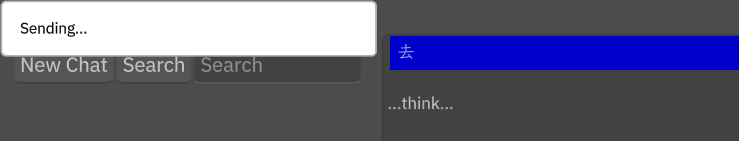
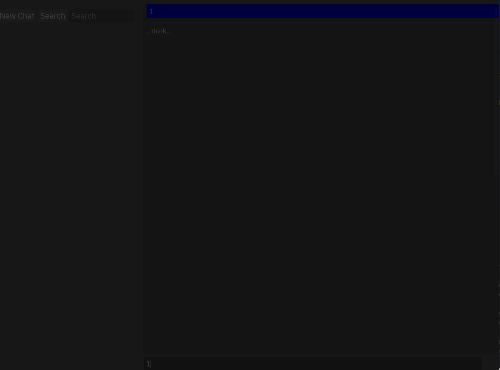
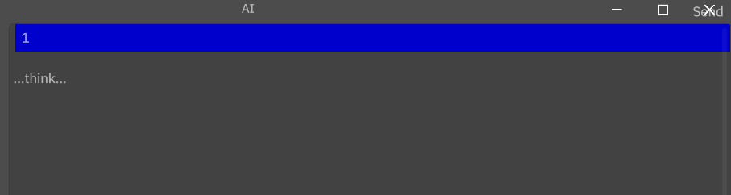

# 结构特特点
## ui
ui通过DSL语言进行构建，类似于css样式，样式比较灵活。
构建中间件时亦可以使用DSL语言进行构建。 需要在进行注册
```rs
impl LiveRegister for App {
    fn live_register(cx: &mut Cx) {
        crate::makepad_widgets::live_design(cx);
        crate::app_ui::live_design(cx);
    }
}
```
组合ui需要看theme_desktop_dark.rs

自定义ui需要看synth_ironfish
## event
event通过handle_event方法可以为每个部件绑定指定的事件。同时如果比较复杂需要等待事件可以查看MatchEvent中的事件，因为所有的事件应该是在其中定义，事件会根据绑定的事件自动触发。

# 动画
动画播放类型
```rs
pub enum Play {
    #[pick {duration: 1.0}]
    Forward {duration: f64}, // 前进
    
    Snap, //折叠
    
    #[live {duration: 1.0, end: 1.0}]
    Reverse {duration: f64, end: f64}, // 反转
    
    #[live {duration: 1.0, end: 1.0}]
    Loop {duration: f64, end: f64}, //循环
    
    #[live {duration: 1.0, end: 1.0}]
    ReverseLoop {duration: f64, end: f64},   // 反转循环 
    
    #[live {duration: 1.0, end: 1.0}]
    BounceLoop {duration: f64, end: f64}, // 弹跳循环
}
```

## 
# 多端适配
todo
# 提示框效果
## TooltipBase

## ModalBase

##  PopupNotificationBase 
 
## PopupMenu
https://www.cnblogs.com/wolipengbo/p/3398603.html#:~:text=%E8%B0%83%E7%94%A8new%20PopupMenu%20%28Context%20context%2CView%20anchor%29%E5%88%9B%E5%BB%BA%E4%B8%8B%E6%8B%89%E8%8F%9C%E5%8D%95%EF%BC%8Canchor%E4%BB%A3%E8%A1%A8%E8%A6%81%E6%BF%80%E5%8F%91%E8%AF%A5%E5%BC%B9%E5%87%BA%E8%8F%9C%E5%8D%95%E7%9A%84%E7%BB%84%E4%BB%B6%E3%80%82,%E8%B0%83%E7%94%A8MenuInflater%E7%9A%84inflate%20%28%29%E6%96%B9%E6%B3%95%E5%B0%86%E8%8F%9C%E5%8D%95%E8%B5%84%E6%BA%90%E5%A1%AB%E5%85%85%E5%88%B0PopupMenu%E4%B8%AD%E3%80%82%20%E8%B0%83%E7%94%A8PopupMenu%E7%9A%84show%20%28%29%E6%96%B9%E6%B3%95%E6%98%BE%E7%A4%BA%E5%BC%B9%E5%87%BA%E5%BC%8F%E8%8F%9C%E5%8D%95%E3%80%82%20%E4%B8%8B%E9%9D%A2%E7%9A%84%E5%AE%9E%E4%BE%8B%E7%A4%BA%E8%8C%83%E4%BA%86%E4%BD%BF%E7%94%A8PopupMenu%E7%9A%84%E5%8A%9F%E8%83%BD%E5%92%8C%E7%94%A8%E6%B3%95%E3%80%82
## 
# 运行

# 中文
需要加载指定的中文字体文件，否则中文会出现乱码。

# todo
检查是否运行，我们可以检查最后一个元素的值是否为默认值

# 待完成
- 对话流处理
- 对话回滚
- 读取配置文件
- 客户端添加嵌入式数据库？
- 持久话存储对话记录？
- 添加对话中提示框
- 美化对话ui框
- 添加删除历史记录的功能

# 问题
没有自适应布局类似margin auto，有些时候难以解决布局问题。